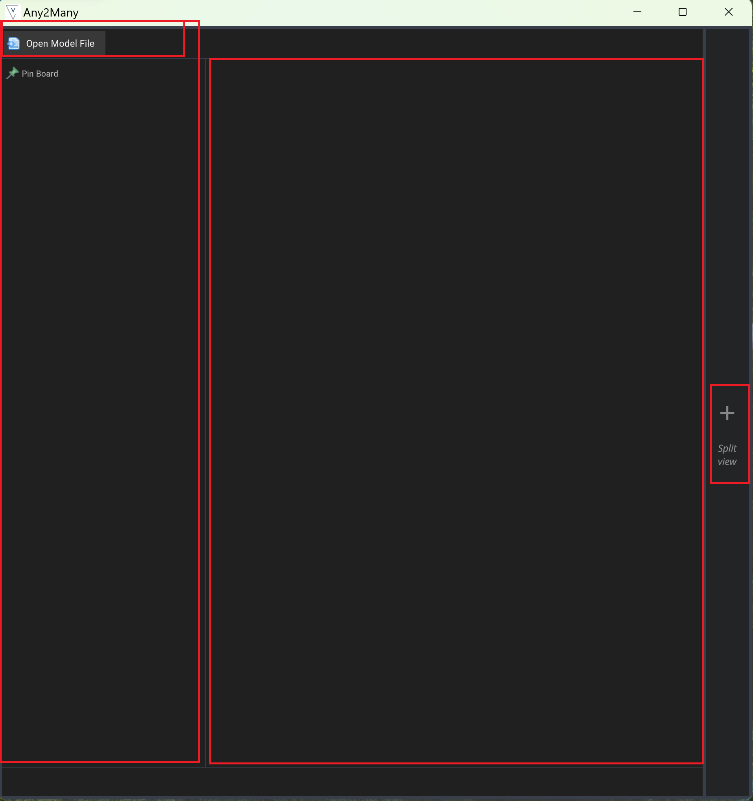
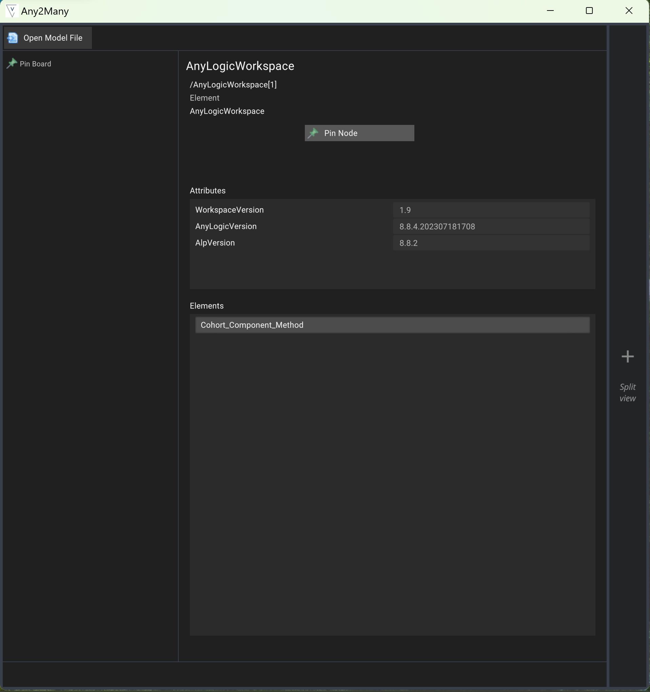
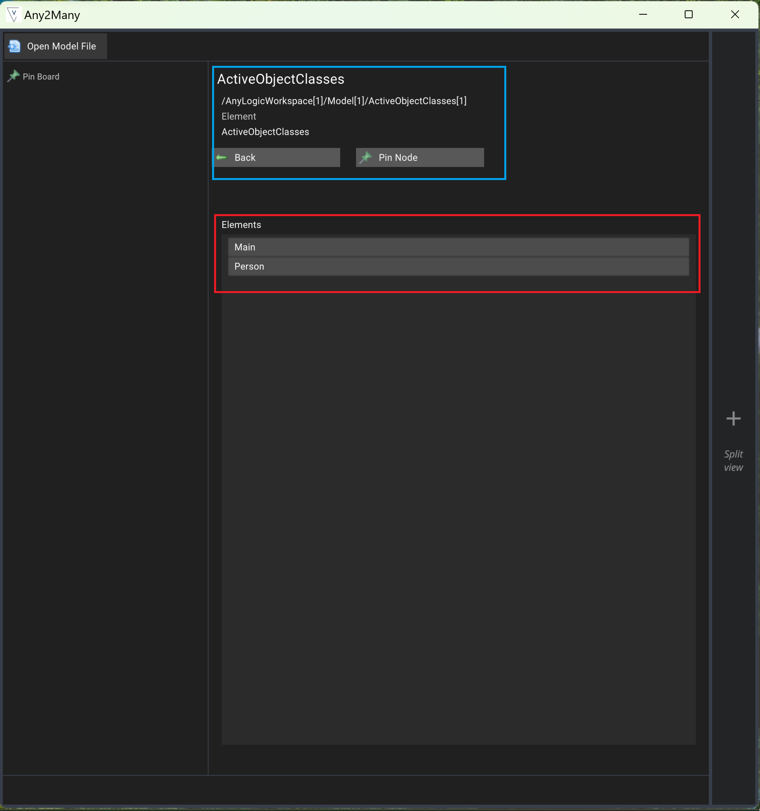
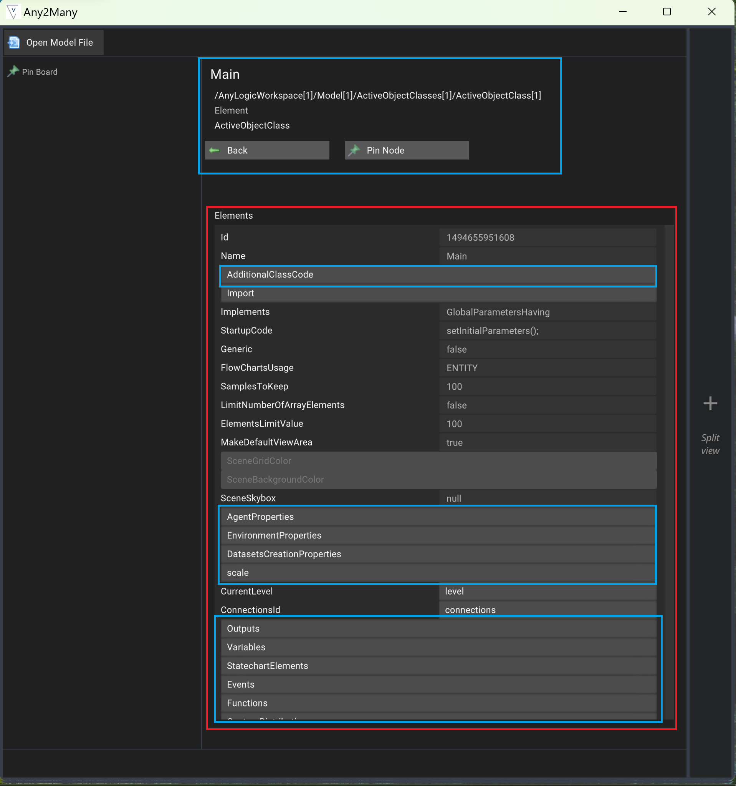
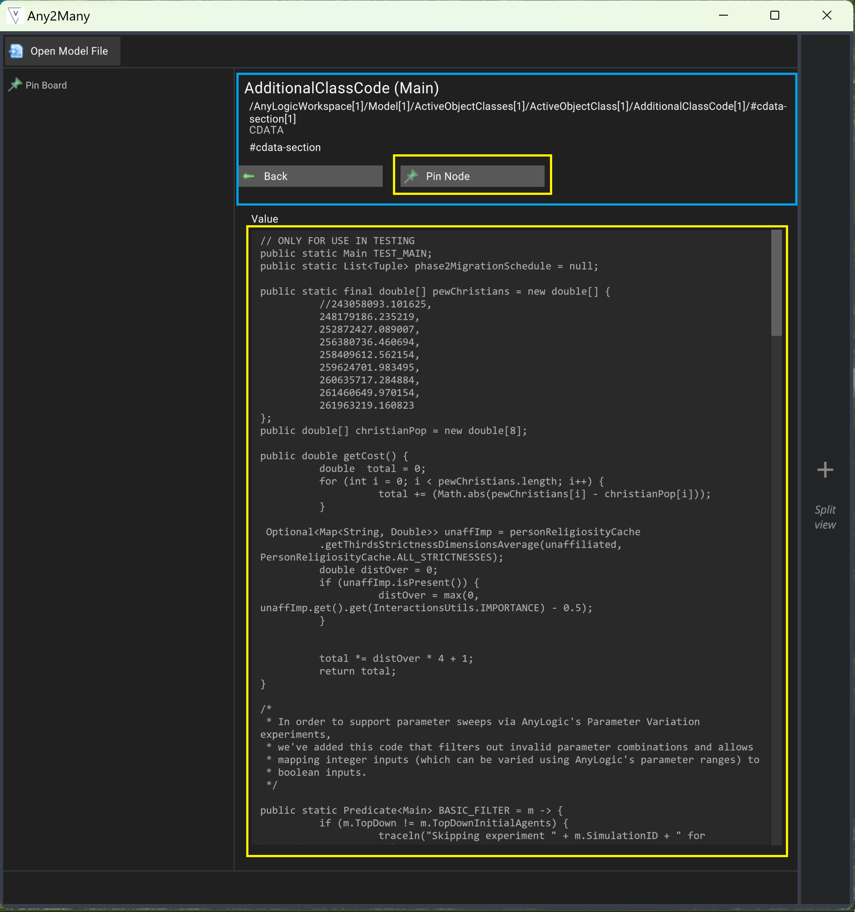
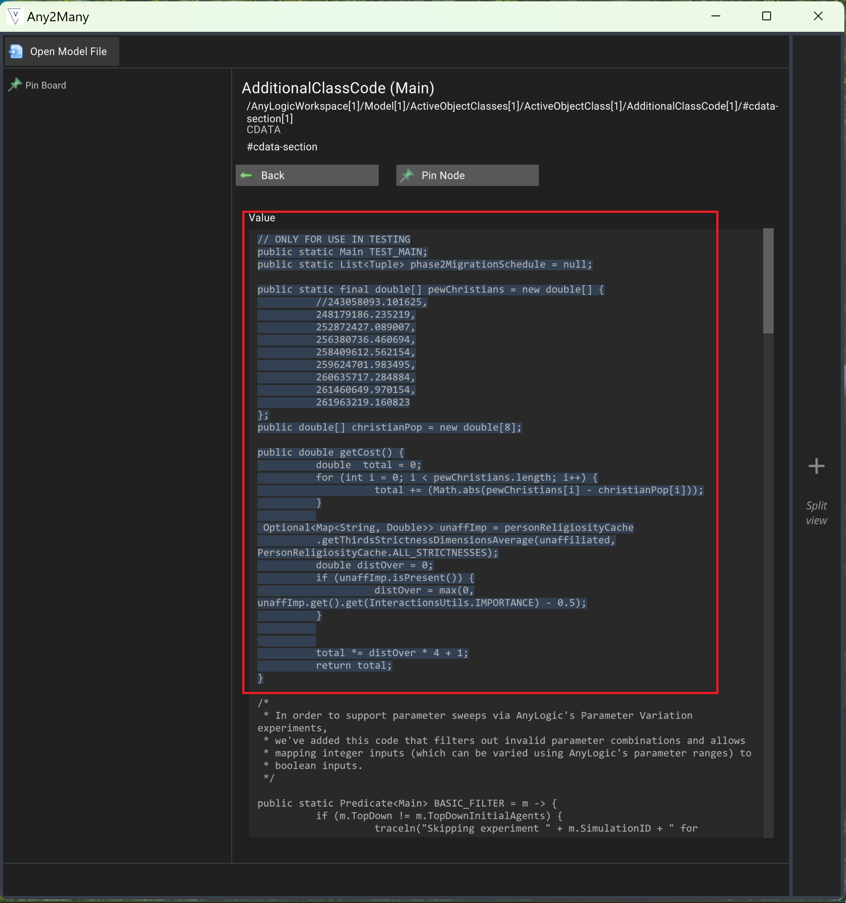
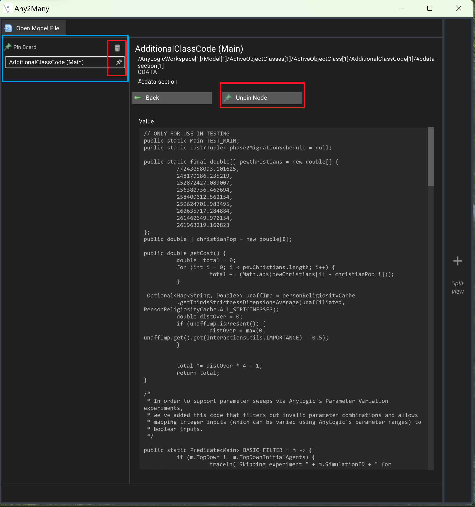
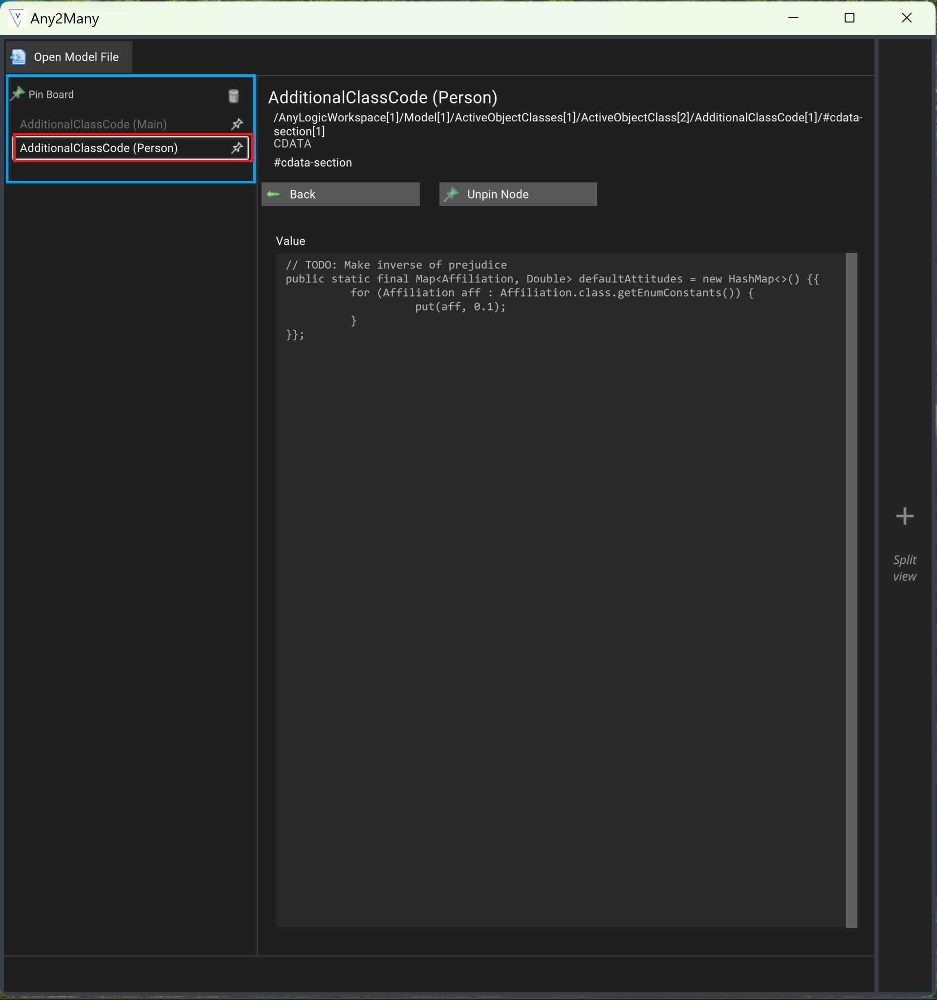
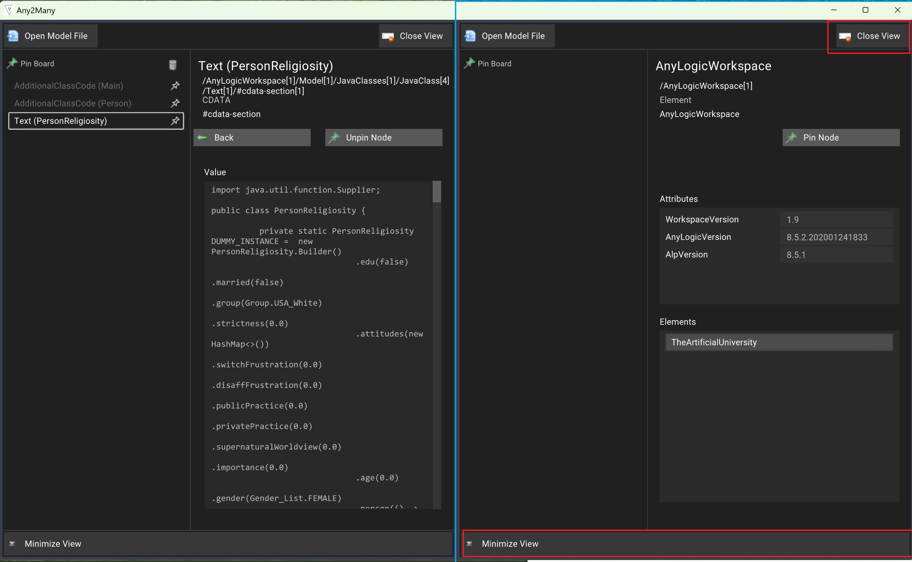
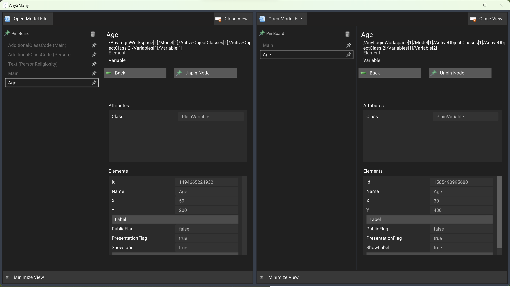

# MRC-Any2Many

## What is it?

This is a glorified XML viewer established around [*.alp files](https://www.anylogic.com). It's main intention was to allow people a way to read/explore AnyLogic files without having to have AnyLogic installed. It provides a fast way to drill down into the XML nodes behind the *.alp* file, grab/highlite code snippets, and pin nodes. It has a way to load two *.alp* files at a time for a side by side comparison.

## How to use

This software was built using Unity3D originally for Windows (we can build it for other platforms if needed) open the zip file 'ParsleALPBuild.zip' and look for the **'Any2Many'** executable.

### Open ALP File

The interface is broken up into three panels - where the left side is for pinned nodes from the XML file and the right side is the current node/navigation of that node with the information table displayed.

### Select Model

With a model open you can now see the navigation panel and the information table - at the initial node you will get all of the basic AnyLogic information.

The blue region presents where you are in the tree as well as options to pin the node. In the red region you have other areas you can drill down that are displayed within the table as grey boxes.

### Navigation, Selection, and Pinning a Node

Depending upon the node you might have a lot of additional nodes and/or information you can look into.

.

When you get down to the details of the node there are sections in which you can highlight the text for copying - this is displayed below in the yellow box. You can use your normal ctrl+c for copying as this will just dump it into your Windows clipboard.

When you need to come back to a node but don't want to keep having to navigate through the graph structure you can pin any node. A pinned node will show up in the left column and when you're on that node it will be a brighter white text.

In this case we've pinned a couple items - notice the difference in active node vs just another non-active node.

### Multiple Models Open

We also wanted a way to open up two models at the same time - this was there to help do a side by side comparison of say two versions of an *.alp* file or in this image two completely different models.

## Saving your Pins

By default we save the pins by the model file in an embedded file format within the application. You should only need to re-open the model and your pins should just reappear. This internal data file is based on the file path location - **so if you make a copy of the model and open it under a different name you won't have any of the pins back**.

## Code for the Software

This software was built with a few paid assets that we cannot release as part of the code base - we could remove those pieces and release the code we generated if it's needed. Feel free to reach out to [John Shull](mailto:jshull@odu.edu?subject=AnyToMany).

## Some ideas for the Future

We found that for our initial use cases this software drastically speed up our ability to navigate through AnyLogic files and to have a way to grab sections of parameters/text from the graph and drop snippets into other programs we were using. Given the latest advances of LLM models - one would argue how much this is needed - but we realized by running both this and a service like ChatGPT together you can very quickly have ChatGPT help you navigate through model structures while you drill down into the details on sections of code and vice versa. Embedding this with another agent tool might be pretty powerful in the future without having to have a tool like that directly integrate with AnyLogic - but then again you could just throw the entire *.alp* file at an LLM and it does a pretty good job of going through it based on prompts.
